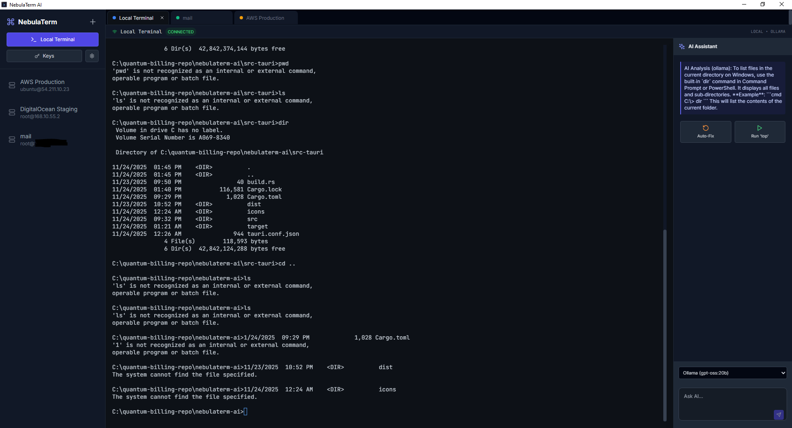
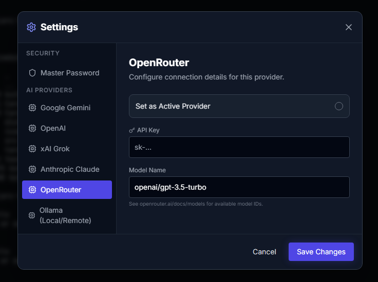

# NebulaTerm AI

**Developed by Quantum Billing, LLC**



## Settings



## Overview

NebulaTerm AI is a next-generation SSH client built for the modern era. Inspired by tools like MobaXterm but enhanced with AI capabilities, it allows you to manage servers, execute commands, and get intelligent real-time assistance for your terminal workflows.

It is designed to be cross-platform (Windows, Linux, macOS) and features a unified interface for server management and terminal interaction.

🌐 **Website**: [https://nebulaterm-ai.quantum-billing.com/](https://nebulaterm-ai.quantum-billing.com/)

## Download

Download the latest version (v1.0.12) for your operating system:

### Windows

**[Download for Windows](https://github.com/codejq/nebulaterm-ai/releases/download/v1.0.12/NebulaTerm-AI_1.0.12_x64-setup.exe)** (64-bit)

1. Click the link above to download the installer
2. Run the downloaded `.exe` file
3. Follow the installation wizard
4. Launch NebulaTerm AI from your Start Menu

### macOS

**[Download for macOS (Apple Silicon)](https://github.com/codejq/nebulaterm-ai/releases/download/v1.0.12/NebulaTerm-AI_1.0.12_aarch64.dmg)** (M1/M2/M3)

1. Click the link above to download the disk image
2. Open the downloaded `.dmg` file
3. Drag the NebulaTerm AI app to your Applications folder
4. Launch from Applications (you may need to allow it in System Preferences → Security & Privacy)

**Alternative**: [macOS Portable Version](https://github.com/codejq/nebulaterm-ai/releases/download/v1.0.12/NebulaTerm-AI_aarch64.app.tar.gz) (.tar.gz)

### Linux

Choose the format that works best for your Linux distribution:

#### Ubuntu/Debian (DEB Package)

**[Download .deb](https://github.com/codejq/nebulaterm-ai/releases/download/v1.0.12/nebula-term-ai_1.0.12_amd64.deb)**

```bash
# Download and install
sudo dpkg -i nebula-term-ai_1.0.12_amd64.deb
# If you get dependency errors, run:
sudo apt-get install -f
```

#### Fedora/RHEL/CentOS (RPM Package)

**[Download .rpm](https://github.com/codejq/nebulaterm-ai/releases/download/v1.0.12/nebula-term-ai-1.0.12-1.x86_64.rpm)**

```bash
# Download and install
sudo rpm -i nebula-term-ai-1.0.12-1.x86_64.rpm
# Or use dnf:
sudo dnf install nebula-term-ai-1.0.12-1.x86_64.rpm
```

#### Universal Linux (AppImage)

**[Download AppImage](https://github.com/codejq/nebulaterm-ai/releases/download/v1.0.12/nebula-term-ai_1.0.12_amd64.AppImage)** (Works on any Linux distribution)

```bash
# Download, make executable, and run
chmod +x nebula-term-ai_1.0.12_amd64.AppImage
./nebula-term-ai_1.0.12_amd64.AppImage
```

---

**Need help?** Visit our [website](https://nebulaterm-ai.quantum-billing.com/) or contact us at <info@qb-solutions.us>

## Features

- **Server Management**:

  - Save, organize, and manage multiple SSH connections.
  - Supports Linux, Windows, and macOS host definitions.
  - Persistent storage of server details locally.
  - SSH key-based authentication support.

- **AI-Powered Terminal**:

  - **Multi-Provider Support**: Choose from multiple AI providers for terminal assistance.
  - **Contextual Assistance**: Query the AI assistant directly from the side panel. It understands your current terminal history.
  - **Auto-Correction**: Type a command and click "Auto-Fix" to have the AI analyze syntax errors and suggest the correct flag or argument.
  - **Multilingual Support**: Fully supports queries and explanations in both **Arabic** and **English**.

- **Secure Credential Storage**:

  - Master password protection for all stored credentials.
  - AES-256-GCM encryption with Argon2 key derivation.
  - Portable encrypted database that can be moved between machines.

- **Modern Interface**:
  - Dark mode designed for prolonged usage.
  - Split-view interface for multitasking between terminal and AI.
  - Visual status indicators for connection health.
  - Multi-tab session management.

## Installation & Setup

### Prerequisites

- Node.js (v18 or higher)
- Rust (for building the executable)

### Development

1. **Clone the repository:**

   ```bash
   git clone https://github.com/your-username/nebulaterm-ai.git
   cd nebulaterm-ai
   ```

2. **Install dependencies:**

   ```bash
   npm install
   ```

3. **Run in development mode:**

   ```bash
   npm run dev
   ```

4. **Configure AI Provider:**

   - Once the application launches, click the Settings icon (gear) in the sidebar
   - Select your preferred AI provider and enter your API key
   - See the [AI Provider Configuration](#ai-provider-configuration) section below for details

   Note: You can also set a default API key in a `.env` file for development:

   ```env
   API_KEY=your_google_gemini_api_key
   ```

## AI Provider Configuration

NebulaTerm AI supports multiple AI providers. Configure your preferred provider in the Settings menu (click the gear icon in the sidebar).

### Supported Providers

1. **Google Gemini**

   - Model: `gemini-2.5-flash` (default), `gemini-pro`, or other Gemini models
   - API Key: Get from [Google AI Studio](https://makersuite.google.com/app/apikey)
   - Best for: Fast responses and general terminal assistance

2. **OpenAI**

   - Models: `gpt-4-turbo`, `gpt-4`, `gpt-3.5-turbo`
   - API Key: Get from [OpenAI Platform](https://platform.openai.com/api-keys)
   - Optional: Custom endpoint URL
   - Best for: Complex command generation and detailed explanations

3. **Anthropic Claude**

   - Models: `claude-3-sonnet-20240229`, `claude-3-opus-20240229`, `claude-3-haiku-20240307`
   - API Key: Get from [Anthropic Console](https://console.anthropic.com/)
   - Best for: Detailed analysis and safe command suggestions

4. **xAI Grok**

   - Model: `grok-beta`
   - API Key: Get from [xAI Platform](https://x.ai/)
   - Best for: Real-time assistance with latest information

5. **OpenRouter**

   - Model: Any model available on OpenRouter (e.g., `openai/gpt-3.5-turbo`)
   - API Key: Get from [OpenRouter](https://openrouter.ai/keys)
   - See [OpenRouter Models](https://openrouter.ai/docs/models) for available models
   - Best for: Access to multiple models with a single API key

6. **Ollama (Local/Remote)**
   - Models: `llama3`, `mistral`, `codellama`, or any Ollama model
   - Endpoint: `http://localhost:11434` (default) or remote server URL
   - API Key: Optional (only if using auth proxy)
   - Best for: Running AI locally without cloud dependencies
   - See [Ollama](https://ollama.ai/) for installation instructions

### Secure Credential Storage

All API keys and credentials are encrypted using:

- AES-256-GCM encryption
- Argon2 key derivation
- Master password protection

Your credentials are stored locally in an encrypted database that can be moved between machines.

## Building Executables

We use **Tauri** to wrap the application into a high-performance native executable.

### Building for Windows

Run the build script:

```bash
.\scripts\build_windows.bat
```

The output files will be located in:

- MSI Installer: `src-tauri/target/release/bundle/msi/NebulaTerm AI_1.0.0_x64_en-US.msi`
- NSIS Setup: `src-tauri/target/release/bundle/nsis/NebulaTerm AI_1.0.0_x64-setup.exe`

### Building for macOS & Linux

Run the shell script:

```bash
chmod +x scripts/build_unix.sh
./scripts/build_unix.sh
```

The output files will be located in `src-tauri/target/release/bundle/`:

- macOS: `.dmg` and `.app`
- Linux: `.deb`, `.AppImage`

### Manual Build

You can also build manually:

```bash
npm run build
npm run tauri build
```

## Automated Releases (GitHub Actions)

This repository includes a GitHub Action workflow that automatically builds binaries for all platforms.

### Creating a Release

1. **Create and push a tag:**

   ```bash
   git tag v1.0.0
   git push origin v1.0.0
   ```

2. **Automated build process:**

   - GitHub Actions will automatically trigger
   - Builds will be created for Windows, macOS, and Linux
   - Installers will be uploaded to the GitHub Release page

3. **Download:**
   - Go to the [Releases](../../releases) page
   - Download the appropriate installer for your platform:
     - Windows: `.msi` or `-setup.exe`
     - macOS: `.dmg`
     - Linux: `.deb` or `.AppImage`

### Build Artifacts

Each release includes:

- **Windows**: MSI installer and NSIS setup executable
- **macOS**: DMG disk image and app bundle
- **Linux**: DEB package and AppImage

## Company Information

**Quantum Billing, LLC**

- **Address**: 13802 NE Airport Way, Suite 600918976, Portland, OR, 97230, United States
- **Email**: info@qb-solutions.us
- **Phone**: +1 409 934 7680
- **Website**: [https://nebulaterm-ai.quantum-billing.com/](https://nebulaterm-ai.quantum-billing.com/)

## License

MIT License. Copyright (c) 2024 Quantum Billing, LLC.
